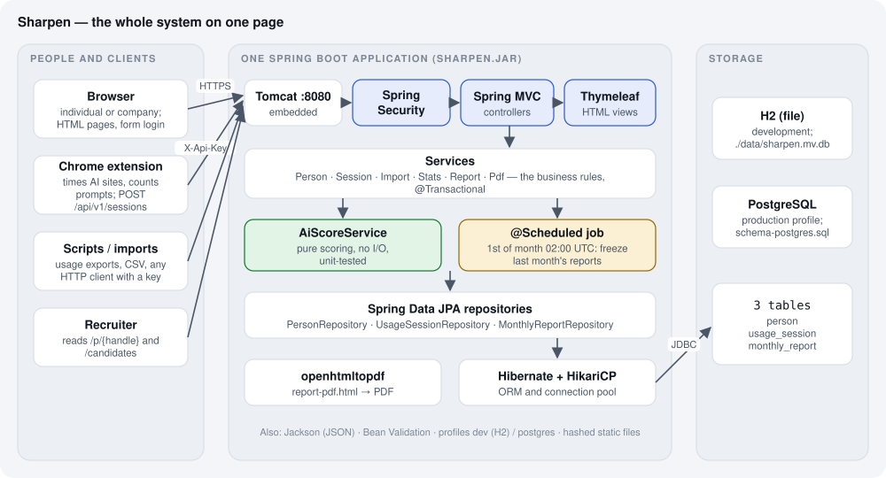
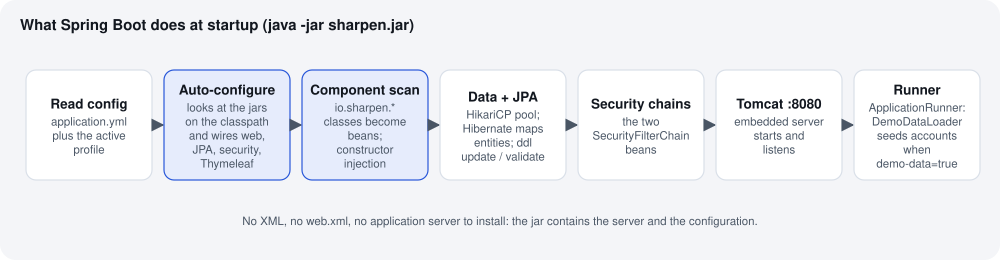
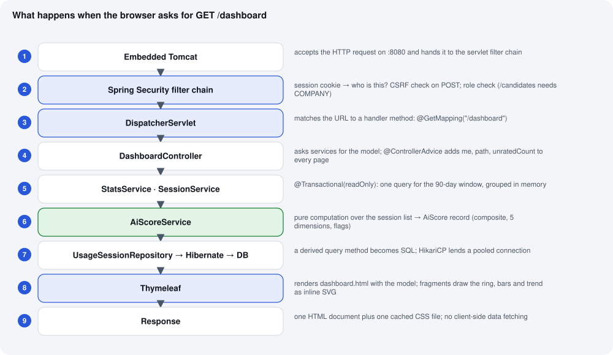
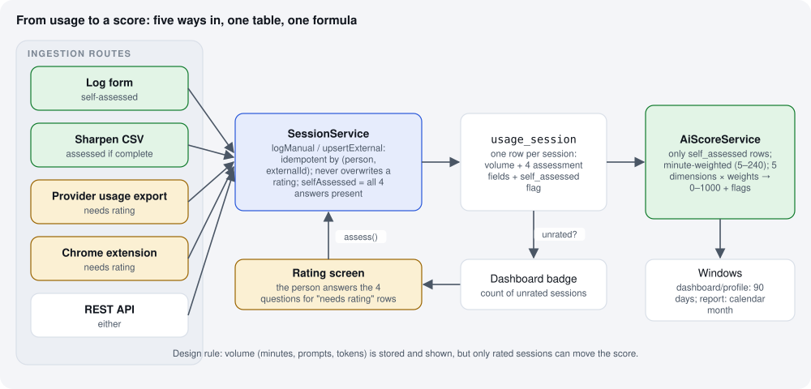
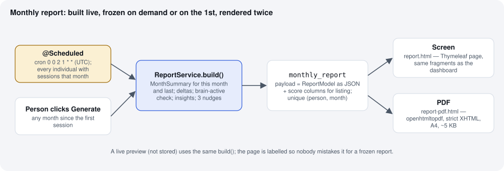
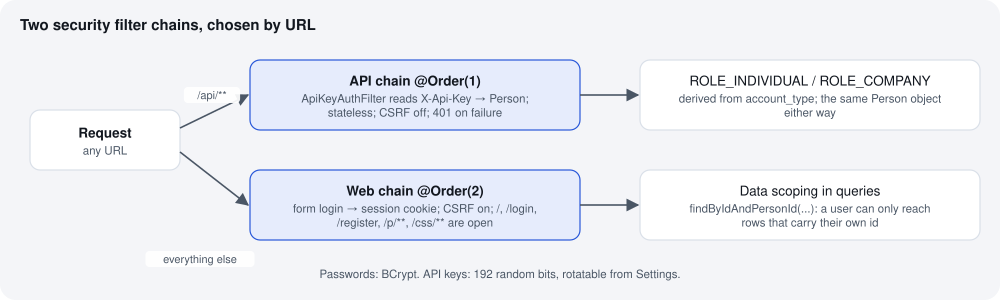

How it works — the design explained
====================================

This chapter is the one to read (or hand to someone) to understand Sharpen end to end: what the system is,
how a request travels through Spring Boot, how a logged session becomes a score, and which Spring Boot
features carry the load and why they were chosen. The diagrams are in ``docs/_static/diagrams`` and are
regenerated with ``python3 gen.py``.

The system on one page
----------------------

Sharpen is **one Spring Boot application** packaged as a single runnable jar. Four kinds of client talk to it:
a browser (individuals and companies), the Chrome extension, scripts that push usage exports, and recruiters
reading public profiles. Inside the jar there are three layers plus two side jobs:

* **Web layer** — Spring Security decides who the caller is, Spring MVC routes the URL to a controller,
  Thymeleaf turns the controller's model into HTML. For ``/api/**`` the controller returns JSON instead.
* **Service layer** — the business rules. ``SessionService`` owns the idempotency and "never overwrite a rating"
  rules, ``ImportService`` parses the three file formats, ``StatsService`` aggregates a window of sessions,
  ``ReportService`` builds and freezes the monthly report, ``PdfService`` renders it.
* **Persistence layer** — Spring Data JPA repositories over three tables, Hibernate as the ORM, HikariCP as the
  connection pool, H2 in development and PostgreSQL in production.
* **Two side jobs** — ``AiScoreService``, a pure function from a list of sessions to a score, and the monthly
  ``@Scheduled`` job that freezes last month's report for everyone.

Nothing else is needed to run it: no application server, no message queue, no cache, no front-end build.
That is deliberate. A prototype that is one deployable unit is the easiest thing to move to Release 1, and each
of the pieces above is the standard Spring Boot answer for its job, so any Java developer can pick it up.

How Spring Boot starts the application
--------------------------------------

``java -jar sharpen.jar`` runs ``SharpenApplication.main``, which calls ``SpringApplication.run``. From there
Spring Boot does the work a team used to do by hand:

1. **Reads configuration** from ``application.yml`` and, if ``--spring.profiles.active=postgres`` is set,
   layers ``application-postgres.yml`` on top. Environment variables such as ``SHARPEN_DB_URL`` override both.
2. **Auto-configures** based on what is on the classpath. Because ``spring-boot-starter-web`` is present it
   creates an embedded Tomcat and a ``DispatcherServlet``; because ``spring-boot-starter-data-jpa`` is present it
   creates a ``DataSource``, an ``EntityManagerFactory`` and a transaction manager; the security and Thymeleaf
   starters do the same for their areas. We wrote none of that wiring.
3. **Scans** ``io.sharpen`` and every class annotated ``@Service``, ``@Controller``, ``@RestController``,
   ``@Repository``, ``@Component`` or ``@Configuration`` becomes a bean. Beans receive their dependencies through
   their constructors (``PersonService(PersonRepository, PasswordEncoder)``), so every class states what it needs
   and can be constructed in a test without Spring.
4. **Creates the security filter chains** from the two ``SecurityFilterChain`` beans in ``SecurityConfig``.
5. **Starts Tomcat** on port 8080.
6. **Runs the ``ApplicationRunner``** — ``DemoDataLoader`` — which seeds the demo accounts when
   ``sharpen.demo-data`` is true. This is why a first run shows a working product instead of an empty screen.

One request, end to end
-----------------------

Take the most common page, ``GET /dashboard``:

1. **Tomcat** accepts the socket, parses HTTP, and hands a ``HttpServletRequest`` to the servlet filter chain.
2. **Spring Security** runs first. The web chain reads the session cookie, finds the authenticated user, and
   checks the URL rule: ``/dashboard`` requires any authenticated user. For a ``POST`` it would also verify the
   CSRF token that Thymeleaf put in the form. An anonymous caller is redirected to ``/login`` here and never
   reaches a controller.
3. **DispatcherServlet** — Spring MVC's front controller — matches the path to
   ``DashboardController.dashboard()`` because of its ``@GetMapping("/dashboard")``.
4. **The controller** is thin. It calls ``PersonService.requireCurrent()`` to load the ``Person`` behind the
   login, then asks ``StatsService`` for the rolling score and the six-month trend and ``SessionService`` for
   unrated and recent sessions, and puts them on the ``Model``. ``GlobalModelAttributes`` (a
   ``@ControllerAdvice``) adds ``me``, ``path`` and ``unratedCount`` so the layout and navigation can use them on
   every page without each controller repeating it.
5. **Services** run inside a transaction (``@Transactional(readOnly = true)``), which lets Hibernate skip dirty
   checking and gives one connection for the whole call. ``StatsService.trend`` issues a single query for the
   six-month window and groups the rows in memory; per person per month the data is small, so one round trip
   beats six.
6. **``AiScoreService.compute``** takes the list of ``UsageSession`` and returns an ``AiScore`` record. It touches
   no database, which is why it has the largest unit test in the project and why the formula can change without
   touching anything else.
7. **Repositories** are interfaces; Spring Data generates the implementation. A method name such as
   ``findByPersonIdAndOccurredOnBetweenOrderByOccurredOnDesc`` becomes the SQL, Hibernate maps the rows to
   entities, and HikariCP lends the connection from its pool.
8. **Thymeleaf** renders ``dashboard.html`` with the model. The page pulls in ``layout.html`` (shell, navigation)
   and ``fragments.html`` (score ring, dimension bars, trend line, weekly bars), which draw the charts as inline
   SVG from numbers the controller supplied — no JavaScript charting library, nothing fetched after load.
9. **The response** is one HTML document plus a CSS file whose URL carries a content hash, so browsers cache it
   for a year and can never serve a stale copy after a deploy.

The same shape applies to every page. The API differs only at steps 2 and 8: the API chain authenticates by
``X-Api-Key`` instead of a cookie, and ``@RestController`` methods return objects that Jackson serialises to JSON.

From a session to a score
-------------------------

Every route — the fifteen-second form, a Sharpen CSV, a provider usage export, the extension, or a raw API
call — ends as a row in ``usage_session``. Two rules in ``SessionService`` make the routes safe to mix:

* **Idempotency by external id.** External rows carry an ``externalId``; ``(person, externalId)`` is unique, so
  re-sending the same day from the extension updates the row instead of creating a twin.
* **A rating is never overwritten by a machine.** If a row has been self-assessed, a later import may update
  minutes, prompts and tokens but not the four assessment answers.

Rows that arrive without an assessment are flagged ``self_assessed = false``. They appear in the sessions list
with a warning tint, are counted in the navigation badge, and are excluded from the score until the person rates
them — a fifteen-second screen with a "save and rate next" button. That loop is the heart of the product: volume
is captured automatically, judgement stays human, and the score cannot be gamed by automation.

``AiScoreService`` then computes five dimensions over the rated rows in the window (90 days for the dashboard and
profile, the calendar month for reports), each a minute-weighted mean or rate, and combines them with fixed
weights into a 0–1000 composite plus flags. The full specification is in :doc:`../requirements/04-scoring`.

The monthly report
------------------

``ReportService.build`` assembles a ``ReportModel``: this month's ``MonthSummary``, last month's, the deltas,
the brain-active panel, rule-based insights, and up to three nudges. Two things can call it: the person, from
the reports page for any month, and the ``@Scheduled`` job on the first of the month for everyone. Either way the
result is stored on ``monthly_report`` as JSON, so a stored report never changes when later sessions are edited or
the formula is tuned. The same model renders twice — ``report.html`` for the screen, using the dashboard's
fragments, and ``report-pdf.html`` for the PDF, a strict-XHTML template that openhtmltopdf turns into an A4
document. Previewing an unstored month uses the same ``build`` and is labelled as a live preview.

Security
--------

``SecurityConfig`` declares two ``SecurityFilterChain`` beans. The first, ordered ``@Order(1)``, matches
``/api/**`` only: it is stateless, CSRF is off, and ``ApiKeyAuthFilter`` turns an ``X-Api-Key`` header into an
authenticated ``Person`` (or a 401). The second handles everything else with form login, a session cookie and
CSRF protection, and leaves the landing page, login, registration, public profiles and static files open.
Roles come from ``account_type``; ``/candidates`` requires ``COMPANY``. Beyond the URL rules, every repository
query that returns a person's data takes the caller's id as a parameter (``findByIdAndPersonId``), so there is no
code path where one account can read another's sessions by guessing an id.

What we use from Spring Boot, and why it matters
------------------------------------------------

.. list-table::
   :header-rows: 1
   :widths: 24 38 38

   * - Feature
     - Where it shows up in Sharpen
     - What it buys us
   * - **Starters and auto-configuration**
     - ``spring-boot-starter-web``, ``-thymeleaf``, ``-data-jpa``, ``-security``, ``-validation``
     - Six dependencies wire the whole stack. No XML, no servlet container to install, no hand-written
       datasource or transaction manager. The ``pom.xml`` is 100 lines and the app is one ``main`` method.
   * - **Embedded Tomcat, single jar**
     - ``mvn package`` → ``target/sharpen.jar``; the Dockerfile copies one file
     - The same artefact runs on a laptop, in Docker and on a server. Deploy = copy + ``java -jar``.
   * - **Dependency injection (constructor)**
     - every service and controller
     - Classes declare what they need; tests construct them directly (``new AiScoreService()``) or let
       ``@SpringBootTest`` wire them. No global state, no service locators.
   * - **Spring MVC**
     - ``web/*Controller``, ``@GetMapping`` / ``@PostMapping``, ``@ControllerAdvice``, ``Model``
     - URL → method mapping, form binding into ``SessionForm`` / ``ProfileForm``, flash messages across
       redirects, and one place to add attributes to every page.
   * - **Bean Validation**
     - ``@NotBlank``, ``@Min``/``@Max``, ``@Email``, ``@PastOrPresent`` on the form classes; ``@Valid`` in
       controllers
     - Input rules live next to the fields, and Thymeleaf shows the error under the right input via
       ``#fields.hasErrors``. Invalid data cannot reach a service.
   * - **Thymeleaf**
     - ``layout.html`` shell, ``fragments.html`` charts, one template per page, ``report-pdf.html``
     - Server-rendered HTML with natural templates: pages open as plain HTML in a browser, CSRF tokens are
       added to forms automatically, and the PDF reuses the same engine.
   * - **Spring Data JPA + Hibernate**
     - ``repo/*Repository`` interfaces, entities in ``domain/``
     - Derived query methods replace boilerplate DAOs; the schema for H2 is generated in development and
       validated against the checked-in PostgreSQL DDL in production, so drift is caught at startup.
   * - **HikariCP**
     - configured by the starter; ``maximum-pool-size`` in the postgres profile
     - A production-grade connection pool with zero code.
   * - **Spring Security**
     - two filter chains, ``BCryptPasswordEncoder``, ``UserDetailsService``, ``ApiKeyAuthFilter``, method-level
       role checks
     - Authentication, CSRF, session handling and role rules in one class; the API-key scheme is a
       fifteen-line filter plugged into the standard chain.
   * - **Scheduling**
     - ``@EnableScheduling`` + ``@Scheduled(cron = "0 0 2 1 * *", zone = "UTC")``
     - The monthly job needs no external cron or queue. (Release 1 adds a lock for multi-instance runs.)
   * - **Profiles and externalised config**
     - ``application.yml`` (dev, H2, demo data) and ``application-postgres.yml`` with ``${SHARPEN_DB_*}``
       placeholders
     - The same jar switches database, disables the H2 console and turns on template caching by one
       environment variable. Secrets never sit in the repository.
   * - **Static resource chain**
     - ``spring.web.resources.chain.strategy.content``; ``@{/css/sharpen.css}`` becomes ``sharpen-<hash>.css``
     - Year-long browser caching with guaranteed invalidation on change. It also fixed the very real problem of
       two local projects sharing ``localhost:8080/css/app.css``.
   * - **Jackson**
     - API responses; ``MonthlyReport.payload``; extension payload parsing
     - Records serialise without annotations; the same ``ObjectMapper`` reads reports back for rendering.
   * - **Spring Boot Test + MockMvc**
     - ``WebFlowTest`` drives register → log → import → API → report → PDF → profile → candidates in-process
     - The full HTTP stack, security included, is tested without starting a server or a browser. Thirteen tests
       run in about twenty seconds.
   * - **Actuator, Flyway, DevTools**
     - not yet
     - Deliberately left for Release 1 (see :doc:`../roadmap`) so the prototype stays small. Each is one
       dependency away.

What we chose not to use
------------------------

* **No JavaScript framework.** Pages are server-rendered; the only client script is two slider labels and the
  extension. The app is fast on a phone because there is nothing to download but HTML and one CSS file.
* **No Lombok.** Entities and forms have explicit accessors. It costs lines, saves a build-time dependency and an
  IDE plugin, and keeps stack traces honest.
* **No microservices, no queue.** One process, three tables. The seams are already in the package structure
  (``scoring`` is pure, ``service`` has no web types), so splitting later is a refactor, not a rewrite.
* **No ORM magic beyond JPA.** Aggregation is done in Java over small per-person windows; the queries stay
  index-friendly and readable.

How to explain it in two minutes
--------------------------------

*Sharpen is a single Spring Boot application. You log an AI session in fifteen seconds — or the browser
extension and usage imports log the volume for you — and answer four questions: how much was yours, did you
check it, did you learn, was it useful. Those answers, minute-weighted, become five dimensions and a 0–1000
score that never rewards hours. On the first of every month a scheduled job freezes a report with a
brain-active check and three things to try; you can download it as a PDF. Your public profile shows only
AI-related facts, and companies can rank candidates by independence or verification instead of prompt volume.
Under the hood it is Spring MVC and Thymeleaf for pages, Spring Security with a form chain and an API-key chain,
Spring Data JPA over three tables, H2 in development and PostgreSQL in production, all in one jar you run with
``java -jar``.*
