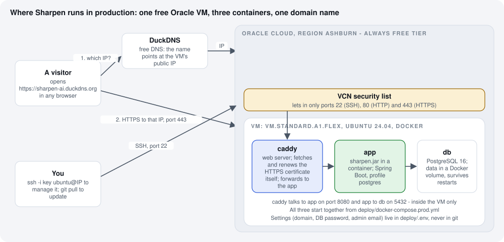
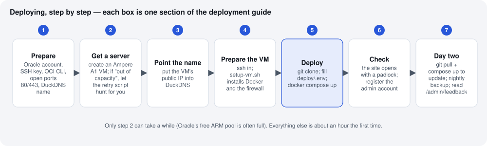

What we are doing, and why
==========================

This chapter puts Sharpen on the internet so that anyone can open it, at **zero monthly cost**. It assumes
nothing: if you have never rented a server or typed a command into a terminal, start here and read in order.
Every word that might be new is explained the first time it appears.

The goal in one sentence
------------------------

Right now Sharpen runs only on your laptop, at ``http://localhost:8080``, and only you can see it. When we are
done, it runs on a small computer in an Oracle data centre, 24 hours a day, at an address like
``https://sharpenscore.com`` that you can send to anyone.

The pieces
----------

Read the picture left to right. Here is what each thing is.

**A server (also called a VM, "virtual machine", or "instance").**
   A computer that lives in a data centre and never switches off. You do not see it or touch it; you talk to it
   over the internet. Ours is rented from Oracle Cloud. Oracle's *Always Free* tier gives every account a
   permanently free ARM-based server (the shape is called ``VM.Standard.A1.Flex``: up to 4 processor cores and
   24 GB of memory). "Always Free" means exactly that: no credit card charge, no expiry, as long as you stay
   inside the free limits, which Sharpen does.

**An IP address.**
   Every computer on the internet has a number like ``150.136.12.34``. That is how other computers find it.
   Our server gets one when it is created. Numbers are hard to remember, which is why the next piece exists.

**A domain name, and DNS.**
   ``sharpen-ai.duckdns.org`` is a name that *points at* the IP number. DNS ("domain name system") is the
   internet's phone book that turns a name into a number. DuckDNS is a free service that lets you pick a name
   ending in ``.duckdns.org`` and tell it which IP it should point to. When you visit the site, your browser
   first asks DuckDNS "what is the IP of sharpen-ai.duckdns.org?", then connects to that IP.

**HTTPS and the padlock.**
   ``https://`` (with an *s*) means the connection is encrypted; the browser shows a padlock. It needs a
   *certificate* — a small file that proves the server really is ``sharpen-ai.duckdns.org``. Let's Encrypt
   gives these away free, and a program on our server called **Caddy** fetches one automatically and renews it
   every couple of months without anyone doing anything. Without HTTPS, browsers show a "Not secure" warning
   and passwords would travel in plain text.

**Ports.**
   One computer can offer several services; a port number says which one you want. Web traffic uses port 80
   (plain HTTP) and 443 (HTTPS). Remote administration uses port 22 (SSH, below). Everything else is closed by
   a firewall, both in Oracle's network (the "VCN security list") and on the server itself.

**SSH.**
   The way you operate a server you cannot touch. From your Mac's Terminal you type ``ssh ubuntu@<ip>`` and
   from then on every command you type runs on the server instead of your laptop. It is protected by a
   *key pair*: a private key file that stays on your Mac (never share it) and a matching public key that is
   installed on the server when it is created. No password is involved.

**Docker and containers.**
   Instead of installing Java, PostgreSQL and Caddy directly on the server and hoping the versions match, each
   one runs in a *container*: a sealed box that carries everything it needs. Docker is the program that runs
   the boxes, and *Docker Compose* starts all three from a single description file,
   ``deploy/docker-compose.prod.yml``. The three containers are:

   ``caddy``
      the front door. Listens on ports 80 and 443, handles HTTPS, and hands every request to the app.
   ``app``
      Sharpen itself — the same ``sharpen.jar`` you build in IntelliJ, running with the ``postgres`` profile.
   ``db``
      PostgreSQL 16, the production database. Its files live in a *Docker volume* so they survive restarts
      and upgrades of the container.

**The** ``.env`` **file.**
   A tiny text file, ``deploy/.env``, with the four settings that differ between your server and anyone
   else's: the domain name, the database password, your admin email, and whether to create demo accounts.
   It is listed in ``.gitignore`` so it is never uploaded to GitHub — it contains a password.

**Git and GitHub.**
   The server gets the code by *cloning* the public repository ``github.com/bhushanladde02/sharpen`` — the
   same code you push from IntelliJ. Updating the live site later is ``git pull`` followed by one Docker
   command.

The steps, in order
-------------------

The following pages walk through each step. Step 2 is the only one that can take unpredictable time, because
Oracle's free ARM servers are popular and often "out of capacity"; :doc:`03-getting-a-server` explains how a
small script waits for one so you do not have to, and :doc:`08-small-vm` is the fallback that launches today
on the always-available 1 GB machine. :doc:`09-pilot-log` records how the real deployment went, mistakes
included — read it alongside the steps.

How to read the command blocks
------------------------------

Commands look like this:

.. code-block:: bash

   ssh -i "$K" ubuntu@<bot-vm-ip> 'tail -3 retry.log'

Type (or paste) the line into a terminal and press Enter. Text in angle brackets like ``<public-ip>`` is a
placeholder: replace it, brackets included, with your real value. Anything after ``#`` on a line is a comment
for you, not for the computer. Where a command should print something specific, the guide says what to
expect, so you always know whether it worked.

Two terminals are involved and it matters which one you are in:

* **Your Mac.** The prompt ends with ``sharpen %``. Commands here run on your laptop.
* **The server.** After ``ssh …`` the prompt changes to ``ubuntu@instance-…:~$``. Commands here run in the
  data centre. Type ``exit`` to come back to your Mac.

Pasting several lines at once is fine *as long as you are already in the right terminal* — a block meant for
the server, pasted while an ``ssh`` command is still connecting, will run on your Mac instead.
