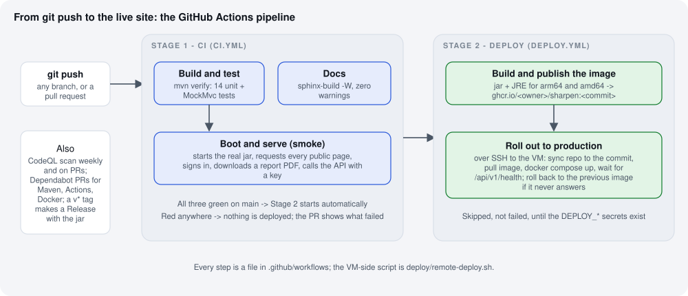

Step 8 — The pipeline: from ``git push`` to the live site
=========================================================

Steps 3–6 deployed Sharpen by hand: log in to the server, pull, build, restart. That is fine once. Doing it
after every change is slow (a five-minute build on the VM), easy to forget, and easy to get wrong. A
*pipeline* does it for you: every push is tested automatically, and every change that reaches ``main`` and
passes the tests is built once, published, and rolled out to the server — with a health check and an
automatic rollback if the new version does not start.

The words
---------

**CI / CD.**
   *Continuous integration*: every change is built and tested by a machine, not by whoever remembers.
   *Continuous delivery/deployment*: a change that passes goes to production without manual steps.

**GitHub Actions.**
   GitHub's built-in automation. A file under ``.github/workflows/`` describes *when* to run (on push, on a
   pull request, on a schedule) and *what* to run (a list of steps on a fresh Linux machine GitHub provides).
   Public repositories get this free with no limits that matter here.

**A workflow, a job, a step.**
   A workflow is one file. It contains jobs; jobs run in parallel unless one says it ``needs`` another. A
   job is a list of steps; a step is a command or a reusable action (``uses: actions/checkout@v4`` is
   "get the code").

**A container image and a registry.**
   The manual deploy built Sharpen's image *on the server*. The pipeline builds it *once* on GitHub's machine
   and stores it in a *registry* — GitHub's own, called **GHCR** (``ghcr.io``). The server then only
   *downloads* the finished image, which takes seconds instead of minutes and means the exact same bytes that
   were tested are what runs.

**A secret.**
   A value the pipeline needs but that must not be in the code: the server's address and the SSH key that
   opens it. GitHub stores them encrypted under *Settings → Environments*; they are injected into the job and
   masked in every log.

**An environment.**
   A named deployment target in GitHub ("production") that owns its secrets and can require a person to click
   *Approve* before a deploy runs. Ours does not require approval; you can switch that on later.

What each file does
-------------------

.. list-table::
   :header-rows: 1
   :widths: 32 68

   * - File
     - Role
   * - ``.github/workflows/ci.yml``
     - **Stage 1.** On every push and pull request: (a) ``mvn verify`` — all unit and MockMvc tests, with a
       results table in the run summary; (b) *Boot and serve* — starts the real jar with demo data and
       checks every public page, a signed-in dashboard, a PDF download and an API call with a key; (c) the
       documentation builds with warnings as errors. Three green ticks or the change is not ready.
   * - ``.github/workflows/deploy.yml``
     - **Stage 2.** Starts by itself when CI has passed on ``main`` (or from the *Actions* tab by hand, for
       any branch or commit). Job *image*: packages the jar, wraps it in a JRE image for both arm64 (the
       Oracle A1 VM) and amd64, pushes it to GHCR as ``ghcr.io/bhushanladde02/sharpen:<commit>`` and
       ``:latest``. Job *deploy*: over SSH to the VM, syncs the repository to that commit, pulls the image,
       restarts the stack, waits for ``/api/v1/health``, rolls back if it never answers.
   * - ``deploy/remote-deploy.sh``
     - The script the deploy job runs *on the VM*. Also usable by hand:
       ``APP_IMAGE=ghcr.io/bhushanladde02/sharpen:<tag> bash ~/sharpen/deploy/remote-deploy.sh``.
   * - ``deploy/Dockerfile.ci``
     - The image recipe used by the pipeline: a JRE plus the already-built jar, nothing compiled inside, so
       the arm64 build takes seconds. (The root ``Dockerfile`` still compiles inside, for laptops and the
       manual VM path.)
   * - ``deploy/docker-compose.prod.yml``
     - Now reads ``APP_IMAGE``. Unset → builds locally as before (manual path). Set → uses the registry image
       (pipeline path).
   * - ``.github/workflows/codeql.yml``
     - Static security analysis of the Java code and the workflow files, on pushes/PRs to ``main`` and every
       Monday. Findings appear under *Security → Code scanning*.
   * - ``.github/dependabot.yml``
     - Once a week GitHub opens pull requests for outdated Maven dependencies, actions and base images. CI
       runs on each, so a green PR is safe to merge.
   * - ``.github/workflows/release.yml``
     - ``git tag v0.1.0 && git push --tags`` → builds, tests, and creates a GitHub Release with the jar
       attached and auto-generated notes.

Turning the deploy stage on
---------------------------

Until the secrets below exist, Stage 2 still builds and publishes the image but skips the rollout (the run
summary says so). Once switched on, every merge to ``main`` ends with ``remote-deploy.sh`` running on the
VM over SSH: it applies any migration script in ``src/main/resources/db/migrations/`` that is not yet recorded
in the ``schema_migration`` table, pulls the new image, restarts the app, waits for the health check and
rolls back if it fails. Once the production VM exists:

1. A key for the pipeline
^^^^^^^^^^^^^^^^^^^^^^^^^

Give GitHub its *own* SSH key rather than yours, so it can be revoked on its own. On your Mac:

.. code-block:: bash

   ssh-keygen -t ed25519 -f ~/.ssh/sharpen_deploy -N "" -C "github-actions-deploy"
   cat ~/.ssh/sharpen_deploy.pub

Add the public key to the server so it is accepted:

.. code-block:: bash

   ssh -i ~/.ssh/sharpen_vm ubuntu@<public-ip> "echo '$(cat ~/.ssh/sharpen_deploy.pub)' >> ~/.ssh/authorized_keys"
   ssh -i ~/.ssh/sharpen_deploy ubuntu@<public-ip> 'echo works'     # must print: works

2. Tell GitHub about the server
^^^^^^^^^^^^^^^^^^^^^^^^^^^^^^^^

On github.com → the repository → **Settings** → **Environments** → **New environment** → name it exactly
``production`` → **Configure**. Under *Environment secrets* add:

.. list-table::
   :header-rows: 1
   :widths: 28 72

   * - Secret
     - Value
   * - ``DEPLOY_HOST``
     - the VM's public IP (or ``sharpen-ai.duckdns.org``)
   * - ``DEPLOY_SSH_KEY``
     - the whole content of ``~/.ssh/sharpen_deploy`` (``cat ~/.ssh/sharpen_deploy``, from
       ``-----BEGIN`` to ``END OPENSSH PRIVATE KEY-----`` inclusive)
   * - ``DEPLOY_USER``
     - ``ubuntu`` (optional; that is the default)
   * - ``GHCR_PULL_TOKEN``
     - only if you keep the image private — see the next section

Under *Environment variables* (not secrets) you may add ``SITE_DOMAIN`` = ``sharpenscore.com``; it is
only used for the link GitHub shows on the deployment.

3. Make the image public (or give the VM a token)
^^^^^^^^^^^^^^^^^^^^^^^^^^^^^^^^^^^^^^^^^^^^^^^^^^^

The first time the pipeline pushes, GHCR creates the package ``sharpen`` as *private*, and a private package
cannot be pulled by the VM without credentials. Easiest: make it public, which matches the public repository.
On github.com → your profile → **Packages** → ``sharpen`` → **Package settings** → *Danger zone* →
**Change visibility** → Public. (Also tick *Inherit access from source repository* there, so the repo's
workflow token can keep pushing.)

If you would rather keep it private: create a *classic* personal access token with only the
``read:packages`` scope (*Settings → Developer settings → Personal access tokens*) and store it as the
``GHCR_PULL_TOKEN`` secret above. The deploy job then logs the VM in before pulling.

4. Run it once
^^^^^^^^^^^^^^

Push any commit to ``main`` — or *Actions → Deploy → Run workflow*. Watch the two jobs; the second ends with
``healthy : https://sharpenscore.com/api/v1/health`` and ``OK``. From now on, every green merge to
``main`` is live within about five minutes, and the manual "Updating" steps in :doc:`05-day-two` are no
longer needed (they still work).

Reading a failed run
--------------------

Click the red cross next to the commit (or *Actions* → the run). The failing job is expanded with the failing
step highlighted; the *Summary* tab has the test table.

.. list-table::
   :header-rows: 1
   :widths: 34 66

   * - Where it failed
     - What it usually means
   * - *Build and test* → a test name in the table
     - A real regression. Run ``mvn test`` locally; the surefire report is attached to the run as an artifact.
   * - *Boot and serve*
     - The jar starts but a page is broken, or it did not start within two minutes; the step prints the
       application log.
   * - *Documentation builds cleanly*
     - An RST syntax slip; the message names the file and line. ``./docs/view.sh`` shows the same error.
   * - *Build and publish the image* → ``denied``
     - GHCR permissions: the package must inherit access from the repository (section 3 above).
   * - *Roll out* → ``Permission denied (publickey)``
     - The deploy key is not in ``~/.ssh/authorized_keys`` on the VM, or the secret is missing a line.
   * - *Roll out* → ``never became healthy … rolling back``
     - The new version crashed on start; the step prints its last 40 log lines. The site is still up on
       the previous version. Most common cause: a schema change not yet applied to PostgreSQL.
   * - *Roll out* → ``pull access denied``
     - The package is private and no ``GHCR_PULL_TOKEN`` was given (section 3).

Doing it by hand when needed
----------------------------

Nothing in the pipeline is magic; each part is a command you can run yourself:

.. code-block:: bash

   # deploy any published image to the VM without GitHub
   ssh -i ~/.ssh/sharpen_vm ubuntu@<public-ip> \
     'APP_IMAGE=ghcr.io/bhushanladde02/sharpen:latest bash ~/sharpen/deploy/remote-deploy.sh'

   # go back to a specific earlier commit's image
   ssh -i ~/.ssh/sharpen_vm ubuntu@<public-ip> \
     'APP_IMAGE=ghcr.io/bhushanladde02/sharpen:<12-char-commit> bash ~/sharpen/deploy/remote-deploy.sh'

   # build the pipeline's image locally
   mvn -DskipTests package && docker build -f deploy/Dockerfile.ci -t sharpen:local .

What was deliberately left out
------------------------------

* **A staging server** — the free tier has room for one VM only. The smoke test in CI is the stand-in.
* **Database migrations in the pipeline** — until Flyway is added (Release 1), a schema change is applied by
  hand on the VM *before* merging the code that needs it; the rollback protects the site if you forget.
* **Approval before deploy** — one click away: *Settings → Environments → production → Required reviewers*.

Who can change what
-------------------

The repository is public, but three settings mean nothing merges, deploys, or reads a secret without the
author's explicit action:

* **Merging.** The ``protect-main`` ruleset requires a pull request with green checks and has an *empty*
  bypass list — even the owner cannot push to ``main`` directly. There are no collaborators; anyone else can
  only open a pull request, which waits for the owner to merge it. ``.github/CODEOWNERS`` names the owner
  for every file, so his review is requested automatically on any pull request.
* **Deploying.** The ``production`` environment has the owner as a *required reviewer* and administrator
  bypass switched off. Every Deploy run pauses at *Waiting for review* until he approves it in the Actions
  tab, and the environment only accepts runs from ``main``.
* **Secrets.** Environment secrets are encrypted and never displayed again after being set. They are
  decrypted only inside an approved run from ``main``; pull requests from forks never receive them, and
  workflows from outside contributors do not run at all until the owner approves them
  (*Settings → Actions → Require approval for all external contributors*). The workflow token is read-only.
  Everything else sensitive — ``deploy/.env``, ``private/`` — is git-ignored and exists only on the owner's
  Mac and the server.
